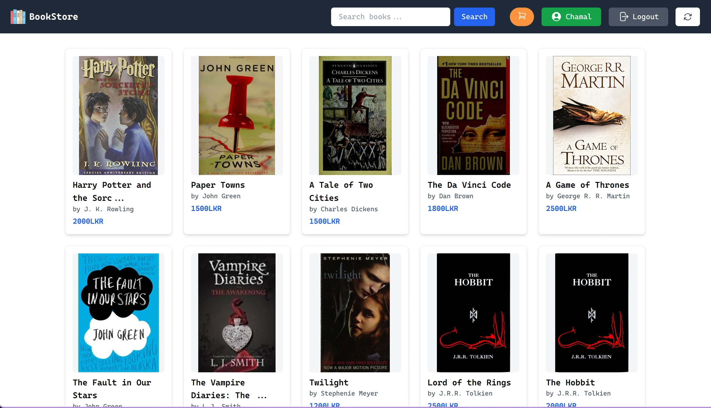
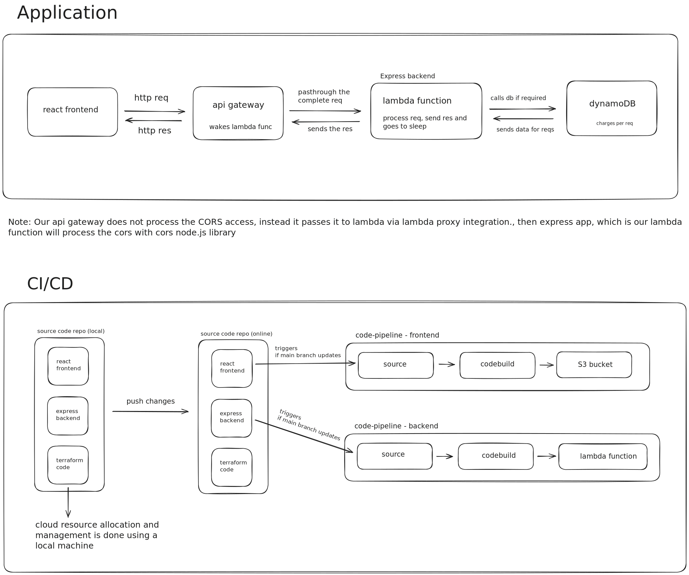

# SkyOps Bookstore - A Serverless E-commerce Web Application




👉 <a href="http://book-store-skyops-terraform-front.s3-website-us-east-1.amazonaws.com" target="_blank">Live Demo</a>

This is a *demo* e-commerce web application built with Express and React and runs on top of serverless technologies. The application allows users to browse books, add them to a shopping cart, and purchase them.

This is done as a part of the group project for the CCS3316 - Cloud Application Development Module of the University to demonstrate the use of serverless technologies in building a modern web application to withstand unpredictable high traffic and be cost-effective.

---

# Content

1. [Features](#-features)
2. [Architecture](#️-architecture)
3. [How to develop locally](#️-how-to-develop-locally)
4. [How to deploy](#-how-to-deploy)
5. [Read more on](#-read-more-on)
6. [Contributing](#-contributing)

---

# ⚡ Features 

1. Fully runs on **AWS serverless computing platforms**.
2. Backend **utilizes AWS lambda functions** to efficiently withstand high traffic while being cost effective.
3. Stateless authentication with **JWT (JSON Web Tokens)**.
4. Frontend is built with **React** and **Tailwind CSS** for a responsive and modern design and hosted on **AWS S3** for fast delivery while being cost-effective.
5. **AWS codebuild and codepipeline** for faster CI/CD with better integration with AWS
5. Hassle free cloud resource management with **Terraform**.

---

# ⚙️  Architecture


---

# 🛠️ how to develop locally

## Prerequisites
1. Node.js and npm
2. Serverless
3. Docker

## Steps

1. Fork, Clone and cd into the repository:
```bash
git clone <your-fork-repo-git-url> && cd skyops-bookstore
```

2. Install the dependencies for both frontend and backend:
```bash
cd frontend && npm install && cd ../backend && npm install
```

4. Start the dynamoDB docker container:
```bash
docker run -d -p 8000:8000 amazon/dynamodb-local
```

3. Start the backend server:
```bash
cd backend && serverless offline start
```

4. Start the frontend server:
```bash
cd frontend && npm start
```

---

# 🚀 How to deploy

## Prerequisites

1. AWS account and an IAM user with following permissions,
```
AmazonAPIGatewayAdministrator
AmazonDynamoDBFullAccess
AmazonS3FullAccess
AmazonSSMFullAccess
AWSCodeBuildAdminAccess
AWSCodePipeline_FullAccess
AWSLambda_FullAccess
CloudWatchLogsFullAccess
```

2. AWS CLI configured with that IAM user.
3. Terraform installed on your local machine.

## Steps

1. Fork, Clone and cd into the repository (if didn't do already in the local development section):
```bash
git clone <your-fork-repo-git-url> && cd skyops-bookstore
```

2. Make a dummy zip file in the backend folder:
```bash
cd backend
echo "Hello, World!" > dummy.txt && zip function.zip dummy.txt && rm dummy.txt
```

> [!Note]
> This is required to succesfully initiate the lambda function resource from terraform. After that when you push changes to the specified branch in terraform, the codepipeline will automatically trigger, build and deploy the backend from the latest source.

3. Create the terraform.tfvars file inside terraform folder with the following variables:

```bash
cd terraform
touch terraform.tfvars
```

```
aws_region = "your-aws-region"
github_owner = "your-github-owner"
github_repo = "your-github-repo"
github_branch = "your-preffered-github-branch-for-production-deployment"
github_token = "your-github-token"
s3_bucket_name = "your-s3-bucket-name"
s3_bucket_name_front = "your-s3-bucket-name-for-frontend"
```

5. Run the terraform script to deploy the backend and frontend with codebuilds and codepipelines:

```bash
terraform init # Initialize the terraform
terraform validate # Validate the terraform file
terraform plan -out=plan.out # Plan the terraform deployment
terraform apply plan.out # Apply the terraform deployment
```

> [!Note]
> To maintain simplicity, we have not utilized any environment variable management service like AWS Secrets Manager which requires additional setting up of resources. If you wish to use them, you can modify the backend code to fetch the environment variables from the AWS Secrets Manager or AWS Parameter Store.

## Why not integrate terraform to the ci/cd pipeline?

Again, this is to maintain the simplicity of the demostration. It is possible to integrate terraform to the ci/cd pipeline to automate the deployment process using something like GitHub Workflows. However,

* If both codepipeline triggering branch and terraform workflow triggering branch is same, that will result in a race condition on which finishes first or both might clash as resource allocation and resource utilization happens at the same time. AWS might handle this in a  smart way but we are not risking it.

* This also complexes the pipeline and makes it harder to debug and maintain.

* Also letting a GitHub workflow run the terraform will also requires giving our aws credentials to GitHub and since the codebase is opensource anyone who has access to the repository can adjust the code, excute the pipeline and grab the credentials.

While we could utilize different branches, different triggering methods or file exclusion methods to mitigate this but again, to maintain the simplicity for the demonstration, we have decided to run it locally and version control the tfstate file in a secure s3 bucket and also encrypted in a private repository as a backup.

---

# 👉 Read more on

* [Frontend](frontend/README.md)<br>
* [Backend](backend/README.md)<br>
* [Terraform-code](terraform/README.md)<br>

---

# 🤝 Contributing

This section is for the members of the team who contributes to the project.

1. Make sure to follow PR template before openning a PR.
2. If you wish to test the backend using your own account, you have to change api endpoints and cors access urls in the frontend.
3. You could also combine serverless-offline and dynamoDB docker image to test the backend locally.
